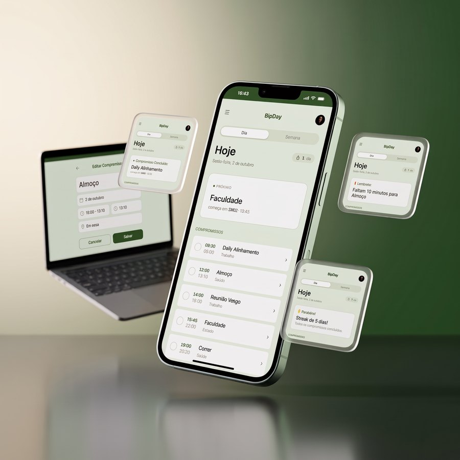
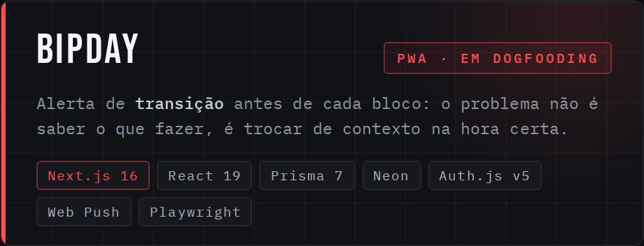
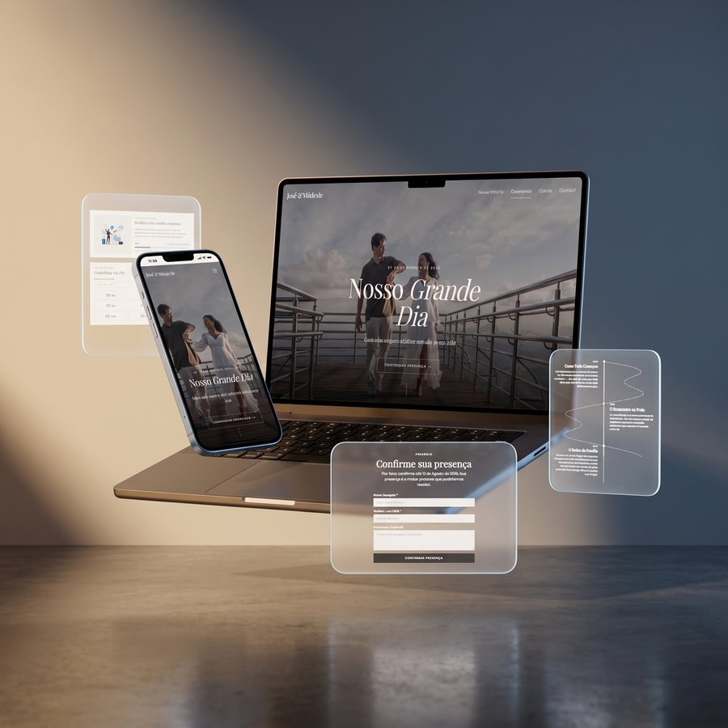
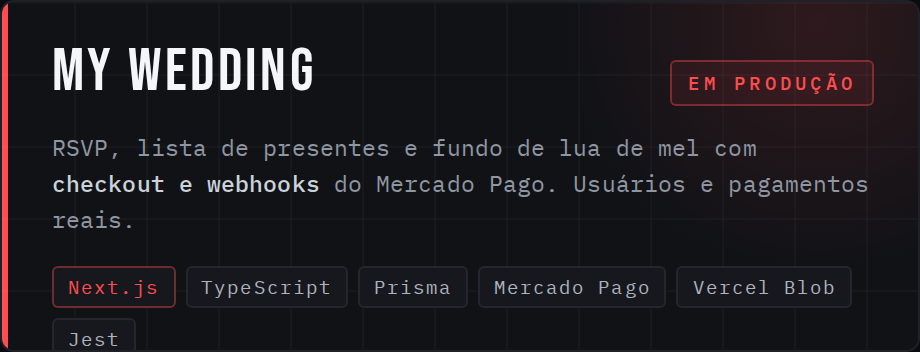
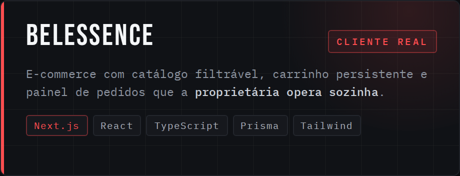
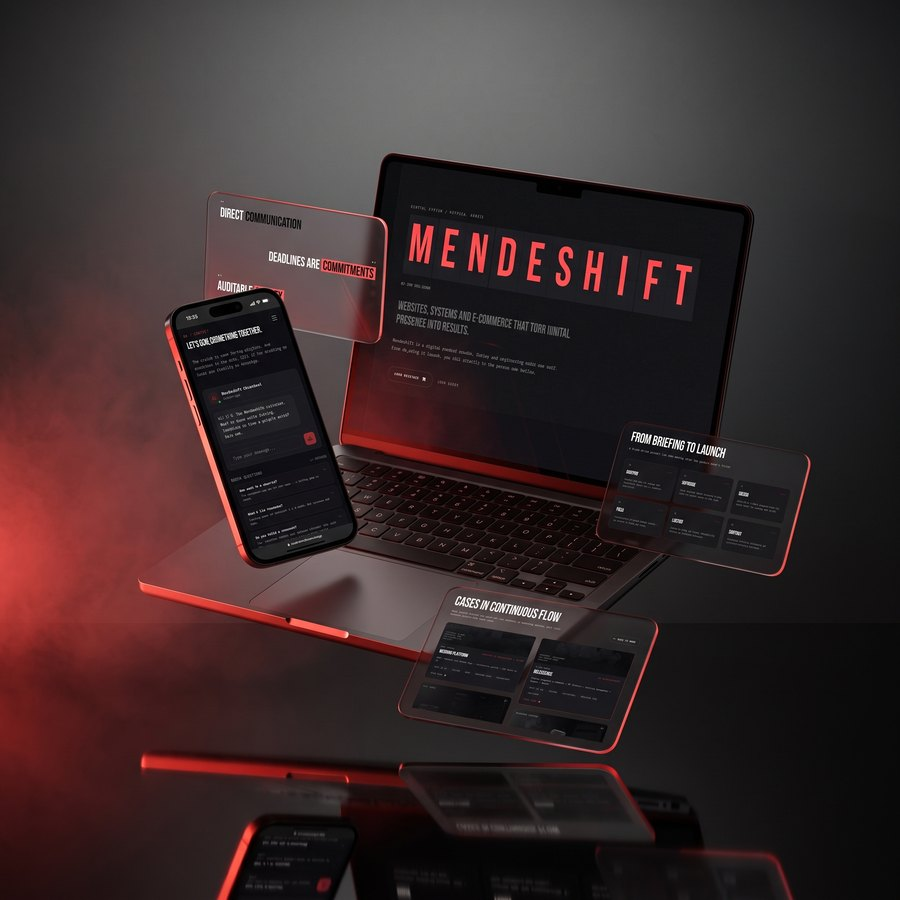
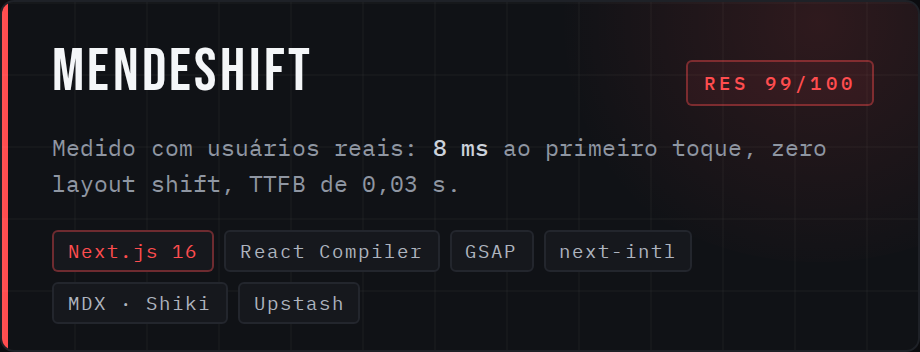

  

 

**[Sobre](#sobre)** &nbsp;·&nbsp; **[Como eu trabalho](#metodo)** &nbsp;·&nbsp; **[Stack](#stack)** &nbsp;·&nbsp; **[Projetos](#projetos)** &nbsp;·&nbsp; **[GitHub](#github)** &nbsp;·&nbsp; **[Contato](#contato)**

 

## `01` &nbsp; Sobre

Desenvolvedor full stack desde 2024. Hoje na **TOTVS**, respondo pela conta de um cliente corporativo de transportes e logística: a plataforma web que a operação usa, as automações em n8n que movem os processos e a integração com o ERP Protheus, que concentra os dados do negócio. Trabalho do levantamento de requisitos ao deploy em produção.

Antes, no **Prodest**, atuei em sistemas estruturantes do Governo do Espírito Santo, com foco em qualidade de código, modernização de legado e APIs em C#/.NET.

Gosto de entrar cedo nas discussões técnicas: entender o problema do negócio antes de abrir o editor, levantar o que pode quebrar e deixar registrado o que descobri para quem vier depois.

 

<table width="100%">
<tr>
<td width="34%" align="center"><b>ONDE ESTOU</b></td>
<td width="33%" align="center"><b>O QUE FAÇO</b></td>
<td width="33%" align="center"><b>MODELO</b></td>
</tr>
<tr>
<td width="34%" align="center">Vitória, ES · Brasil</td>
<td width="33%" align="center">Web · Front-end · Integrações e APIs</td>
<td width="33%" align="center">Remoto, ou presencial na Grande Vitória</td>
</tr>
</table>

## `02` &nbsp; Como eu trabalho

> **Teste antes do commit.** &nbsp;Vitest ou Jest no unitário, Playwright no end-to-end, com husky e lint-staged barrando o que não deveria entrar no repositório.

> **Regra escrita, não combinada.** &nbsp;Cada projeto carrega um documento de diretrizes versionado — stack permitida, armadilhas conhecidas, quality gate. Quando outro dev abre o repo, as regras estão lá.

> **Decisão com motivo.** &nbsp;Escolher entre dois caminhos e registrar por quê. É o que separa código que sobrevive de código que alguém reescreve em seis meses.

## `03` &nbsp; Stack

**Dia a dia**

<b>Corporativo &nbsp;·&nbsp; o que uso na TOTVS e usei no Prodest</b>

 

<b>Corporativo &nbsp;·&nbsp; o que uso na TOTVS e usei no Prodest</b>

 

<b>Qualidade &nbsp;·&nbsp; o que roda antes do merge</b>

 

<b>Qualidade &nbsp;·&nbsp; o que roda antes do merge</b>

 

<b>Também trabalho com</b>

 

<b>Também trabalho com</b>

 

## `04` &nbsp; Projetos

<table width="100%">
<tr>
<td width="50%">

  

</td>
<td width="50%">

  

</td>
</tr>
<tr>
<td width="50%">

  

</td>
<td width="50%">

  

</td>
</tr>
</table>

<b>O que tem dentro de cada um</b>

 

**[BipDay](https://github.com/JoseLuizMendes/rotina-app)** &nbsp;`PWA · TDAH`

O diferencial não é mais uma lista de tarefas: é o **bip** — o alerta de transição que avisa pouco antes de cada bloco começar, porque a dificuldade costuma não ser saber o que fazer, e sim trocar de contexto na hora certa. Timer visível e sequência sem punição: falhar não pinta nada de vermelho.

PWA instalável com service worker gerado no build e notificações Web Push com VAPID, multi-tenant por username, autenticação em sessão JWT e recorrência de blocos com RRULE. Testes em dois níveis e design system documentado. Em dogfooding antes de ir a mercado.

 

**[My Wedding](https://github.com/JoseLuizMendes/My-Wedding-New)** &nbsp;`em produção`
**[My Wedding](https://github.com/JoseLuizMendes/My-Wedding-New)** &nbsp;`em produção`

Confirmação de presença para dois eventos, lista de presentes com reserva e fundo de lua de mel com checkout e webhooks do Mercado Pago. Autenticação de convidado por código OTP, upload de fotos com compressão no browser antes de subir para o Vercel Blob, e e-mail transacional.

Usuários, pagamentos e uploads reais — foi o site do meu próprio casamento, o que torna cada bug um problema de verdade.

 

**[Belessence](https://github.com/JoseLuizMendes/Belessence)** &nbsp;`cliente real`
**[Belessence](https://github.com/JoseLuizMendes/Belessence)** &nbsp;`cliente real`

Catálogo com filtros, carrinho com estado persistente, checkout e painel de gestão de pedidos. UI baseada em componentes para que a proprietária atualize o catálogo sem conhecimento técnico. Mobile-first, adequado a uma marca com aquisição por redes sociais.

 

**[MendeShift](https://github.com/JoseLuizMendes/Mendeshift)** &nbsp;`Real Experience Score 99/100`
**[MendeShift](https://github.com/JoseLuizMendes/Mendeshift)** &nbsp;`Real Experience Score 99/100`

Medido com usuários reais: 8 ms ao primeiro toque, zero layout shift, TTFB de 0,03 s. GSAP e Lenis em vez de biblioteca de scroll pronta para reduzir bundle, coordenação entre componentes por eventos de DOM sem contexto global, i18n com next-intl e build Docker multi-stage com output standalone.

Blog em MDX com realce de sintaxe via Shiki, formulário de contato com rate limiting em Upstash Redis e envio por Resend.

## `05` &nbsp; GitHub

  

## `06` &nbsp; Estudando agora

Mantenho os projetos acima como laboratório porque errar ali é barato e me deixa mais preparado na hora de decidir em produção.

### Aberto a conversar sobre vagas de Engenheiro de Software, Front-end e Web

**VITÓRIA, ES** &nbsp;·&nbsp; REMOTO OU PRESENCIAL NA GRANDE VITÓRIA &nbsp;·&nbsp; [JOSEMENDESS004@GMAIL.COM](mailto:josemendess004@gmail.com)

